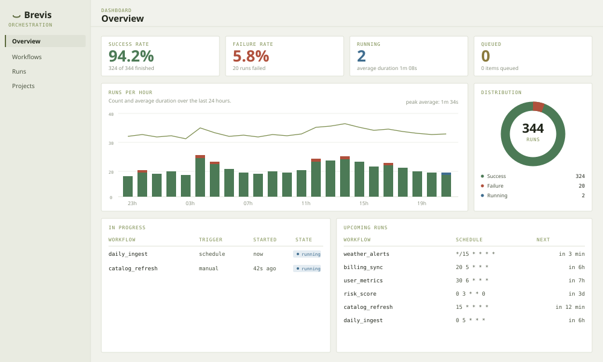
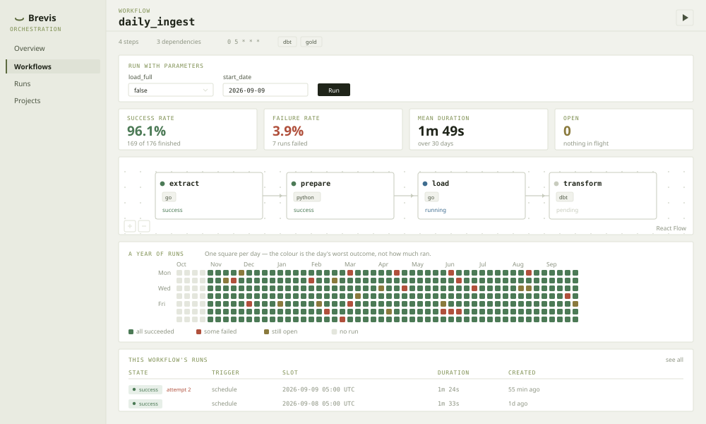

<div align="center">


# brevis.sh

**A data orchestration runtime, in Go.**

Declarative transformation, workflow orchestration, a persistent queue, a
scheduler and an operational interface — in one binary. Every step runs as its
own Kubernetes pod, with its own image.

[**Website**](https://brevis.sh) · [**Documentation**](https://brevis.sh/docs/) · [Quickstart](https://brevis.sh/docs/quickstart/) · [SDK](https://pkg.go.dev/github.com/AreteAcademy/brevis/sdk) · [Discussions](https://github.com/AreteAcademy/brevis/discussions)

[](https://github.com/AreteAcademy/brevis/actions/workflows/test.yml) [](https://github.com/AreteAcademy/brevis/actions/workflows/quality.yml) [](https://pkg.go.dev/github.com/AreteAcademy/brevis/sdk)

[](https://github.com/AreteAcademy/brevis/releases) [](https://github.com/AreteAcademy/brevis/releases) [](https://pypi.org/project/brevis/) [](LICENSE)

</div>

---

A workflow is one file. Each step declares its own image, and the engine runs
each one as its own pod:

```yaml
name: daily_ingest
schedule: "0 5 * * *"     # five-field cron
type: dag

steps:
  - id: extract
    image: ghcr.io/example/extract:1.4        # 5.8 MB, a Go step
    run: ./extract --since yesterday

  - id: transform
    image: ghcr.io/dbt-labs/dbt-postgres:1.9  # 620 MB, dbt
    run: dbt build --select bronze+
    depends_on: [extract]
```

```bash
brevis validate examples/            # validates with no database; good for CI
brevis run examples/hello.yaml       # runs now, on this instance
brevis serve                         # the API and the UI, on :8080
brevis scheduler --concurrency 5     # materializes slots and runs them
```

The operational interface is in that same binary — there is no second service to
install and keep alive:

<p align="center">
  <a href="https://brevis.sh/#console"></a>
  <a href="https://brevis.sh/#console"></a>
</p>

<p align="center"><sub>The overview, and one workflow. Four more screens at <a href="https://brevis.sh/#console">brevis.sh</a> — the run list, a single run with its auto params, and projects.</sub></p>

> The project is written in English. See [CONTRIBUTING.md](CONTRIBUTING.md).

| | |
|---|---|
| **Start here** | [Quickstart](https://brevis.sh/docs/quickstart/) · [Installation](https://brevis.sh/docs/installation/) |
| **Reference** | [CLI](https://brevis.sh/docs/cli/) · [Workflow YAML](https://brevis.sh/docs/workflows/) · [Configuration](https://brevis.sh/docs/configuration/) |
| **Writing a step** | [Go SDK](https://brevis.sh/docs/sdk/) · [Python](https://brevis.sh/docs/python/) |
| **In this repo** | [Architecture](docs/plan.md) · [What is being worked on](TASK.md) · [Per-phase reports](docs/phases/) |
| **For agents** | [llms.txt](https://brevis.sh/llms.txt) — the docs as Markdown |

## SDK

```bash
go get github.com/AreteAcademy/brevis/sdk@latest
```

HTTP extraction with retry, timeout, guard and pagination; batched loading into
BigQuery, Postgres, MySQL, Redshift and files. Requires Go 1.23+.

- API reference: [pkg.go.dev](https://pkg.go.dev/github.com/AreteAcademy/brevis/sdk)
- Guide and design decisions: [`sdk/README.md`](sdk/README.md)
- Runnable examples: [`examples/`](examples/) — start with
  [`examples/quickstart/`](examples/quickstart/), a full stack from a public API
  to a CSV
- Version history: [`CHANGELOG.md`](CHANGELOG.md)

> **Do not use `v0.1.0`.** It was published with a broken `go.mod`, and the Go
> proxy is immutable, so there is no fixing it. Start at `v0.1.1`.

SDK CLI: [`cmd/brevis-sdk/`](cmd/brevis-sdk/) — `go install github.com/AreteAcademy/brevis/cmd/brevis-sdk@latest`

The Brevis binary itself (`serve`, `scheduler`, `migrate`, `publish`) is
[`cmd/brevis/`](cmd/brevis/), built with `make build`.

**Status: PHASE 6 complete.** YAML workflows, a persistent queue, a cron
scheduler, backfill, a server-rendered UI (an overview with metrics and charts, a
workflow list with search, filters, pause and run) and a DAG view showing each
step's state live — with an SDK step expanding into one box per element of its
pipeline. See `docs/phases/`.

Fonts and bundles are served from the binary itself — the UI works with no route
to the internet.

**White label**: title, subtitle, phrase and palette come from a YAML
(`brand.example.yaml` → `brand.yaml`, or `BREVIS_BRAND_FILE`). The colours
override the CSS variables at runtime, so changing the theme recompiles nothing.
The "Powered by Brevis" footer does not come from configuration — it comes from
the code.

```bash
brevis publish examples/hello.yaml   # writes the workflow and its schedule to the database
brevis scheduler --concurrency 5     # materializes slots and runs them
brevis backfill diario --from 2026-01-01 --to 2026-01-31
```

The scheduler **creates** runs; the queue **executes** them. The two loops are
independent: either can go down without affecting the other.

The twelve subcommands, with flags, environment variables, endpoints and Makefile
targets: [`docs/COMMANDS.md`](docs/COMMANDS.md).

On Kubernetes, **each step becomes a pod** with the image declared in the YAML --
there is no generic worker waiting for work; the work brings its own runtime. The
same file runs locally as a process. See
[`docs/KUBERNETES.md`](docs/KUBERNETES.md).

The images are per role, not per project: **5.8 MB** for a Go step, 118 MB for
Python, 620 MB for dbt (with the parse baked in, 2.7 s less per pod). See
[`docs/IMAGES.md`](docs/IMAGES.md).

A workflow can declare **run parameters** -- what changes between two dispatches
without editing the file:

```yaml
params:
  - name: load_full
    type: boolean
    default: "false"
  - name: start_date
    type: string
    pattern: '^\d{4}-\d{2}-\d{2}$'

steps:
  - id: run
    run: dbt build --vars '{"load_full":"{{ .load_full }}"}' --select bronze_x+
```

```bash
brevis run wf.yaml --param load_full=true
brevis backfill diario --from 2026-01-01 --to 2026-01-31 --param load_full=true
```

In the UI, a workflow with params gets a form instead of the plain button.

`concurrency: 1` caps simultaneous runs of the same workflow -- which stops a
`*/15` from overlapping itself.

The YAML accepts `type: chain` (the file's order) or `type: dag` with
`depends_on`. `chain` is sugar: it becomes edges in the parser, and the engine
only ever knows a DAG.

`examples/quickstart/` is the one that **runs** end to end, against a public API.
`examples/hello.yaml` runs anywhere; the other two came from the plan and show
the format, calling `python`, `docker.run` and `./notify.sh`, which do not exist
in the worker image.

## Images

```bash
docker login -u daniel3843
make image-push            # daniel3843/brevis:<VERSION> e :<VERSION>-worker
```

Two images of the same binary: `:<version>` is the API on distroless (it executes
nothing, so it needs no shell) and `:<version>-worker` is Alpine with a shell, for
the workflows' `run:` steps. Details in [`docs/PUBLISHING.md`](docs/PUBLISHING.md).

## Running locally

```bash
make dev     # hot reload: templ + tailwind + go build on every change
make up      # Postgres + API
make smoke   # checks /health and /ready
make logs
make down
```

```bash
make check   # gofmt + vet + tests
make build   # binary in bin/
```

## Configuration

| variable | default | |
|---|---|---|
| `BREVIS_DATABASE_URL` | — | **required** |
| `BREVIS_ENV` | `local` | `local` logs as text; anything else, JSON |
| `BREVIS_HTTP_ADDR` | `:8080` | |
| `BREVIS_METRICS_ADDR` | `:9090` | Prometheus scrape endpoint. A **separate** port from the one above; set to `""` to serve nothing |
| `BREVIS_LOG_LEVEL` | `info` | |
| `BREVIS_SHUTDOWN_TIMEOUT_SECONDS` | `15` | |

## Endpoints

| | |
|---|---|
| `GET /health` | liveness — does **not** touch the database |
| `GET /ready` | readiness — does, and names the dependency that failed |
| `GET /metrics` | Prometheus exposition — on `BREVIS_METRICS_ADDR`, **not** on the port above |

The separation is deliberate: a liveness probe that depends on an external
dependency makes Kubernetes kill the pod when the database wobbles, instead of
merely taking it out of the load balancer.

`/metrics` is on a port of its own for a different reason. The HTTP port is the
one behind the Ingress and behind the login, and a scrape endpoint there would
either need a session — which no scraper has — or publish every workflow and
step name to whoever finds the path. See [`docs/OBSERVABILITY.md`](docs/OBSERVABILITY.md).

## Migrations

```bash
brevis migrate up|down|status
```

Embedded in the binary and applied by their own subcommand -- `serve` never
changes the schema.
